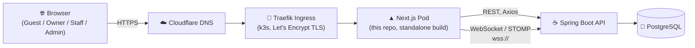

# 🏨 PrimeStay — Hospitality Booking & F&B Platform (Frontend)

<p align="center">
  <a href="https://prime-stay.app"></a>
  
  
  
  
  
  
</p>
<p align="center">
  
  
  
  
  
  
</p>

**PrimeStay** is a full-featured hospitality marketplace: property discovery and booking, QR-based in-room food ordering, real-time guest↔staff messaging, and role-scoped consoles for owners and platform admins. This repository is the **Next.js App Router frontend** — it is **live in production**.

> 🔴 **Live:** [prime-stay.app](https://prime-stay.app) · [www.prime-stay.app](https://www.prime-stay.app) — API at `api.prime-stay.app`
>
> This repository contains **only the frontend application**. The Spring Boot API is maintained in a separate repository.

---

## 📚 Table of Contents

- [Features by Role](#-features-by-role)
- [Tech Stack](#-tech-stack)
- [Screenshots](#-screenshots)
- [Architecture](#-architecture)
- [Route Map](#-route-map)
- [Getting Started](#-getting-started)
- [⚠️ The one thing that will break production](#️-the-one-thing-that-will-break-production)
- [Docker & Deployment](#-docker--deployment)
- [Internationalisation](#-internationalisation)
- [PWA](#-pwa-staff-only)
- [Testing](#-testing)
- [Contributing](#-contributing)

---

## ✨ Features by Role

| Role | Highlights |
|---|---|
| 🧳 **Guest** | Property search & booking, QR menu → cart → checkout, PayHere payment popup, live order tracking, order history & receipts, in-stay messaging with staff |
| 🏠 **Owner** | Property & room management, rate plans, availability calendars, reservations, staff management, payouts, settings |
| 🧑‍🍳 **Staff** | Live order queue (WebSocket + SSE), guest messaging, order status updates |
| 🛡️ **Admin** | User & property management, content moderation, finance & payouts, audit logs, platform analytics, settings |

Realtime guest↔staff messaging and live order status run over **STOMP-over-WebSocket** (`@stomp/stompjs`), with server-sent events feeding the staff order stream.

---

## 🧱 Tech Stack

| Layer | Technology |
|---|---|
| Framework | Next.js **15.5.9** (App Router, `output: "standalone"`) |
| UI Runtime | React **19.1.0** |
| Language | TypeScript |
| Styling | Tailwind CSS **v4** + shadcn/ui |
| State | Zustand **5** |
| Forms & Validation | React Hook Form + Zod |
| HTTP | Axios |
| Realtime | `@stomp/stompjs` **7** (STOMP over WebSocket) + SSE |
| i18n | next-intl **4** (English, Spanish) |
| Payments | PayHere (Sri Lanka) popup checkout |
| Images | Cloudinary + Next/Image (`res.cloudinary.com`, `images.unsplash.com`, `picsum.photos`) |
| PWA | `@ducanh2912/next-pwa`, scoped to `/staff` |
| Tables & Charts | TanStack Table, Recharts |
| Maps | Leaflet / react-leaflet |

**Scale:** 112 routes (`page.tsx`), 183 components, 2 locales.

---

## 🖼️ Screenshots

<!--
  Add screenshots or a short screen-capture GIF for each role once available, e.g.:
  
  
  
-->
_Screenshots coming soon — guest booking flow, QR ordering, owner dashboard, and admin console._

---

## 🏗️ Architecture



The Next.js frontend and the Spring Boot API each run as their own pod on a single-node **k3s** cluster on AWS EC2. Traefik terminates TLS (Let's Encrypt, auto-renewed) and routes `prime-stay.app` to the frontend and `api.prime-stay.app` to the backend. Cloudflare handles DNS in front of the cluster.

---

## 🗺️ Route Map

<details>
<summary><strong>Expand full route map</strong> (112 routes across 6 route groups)</summary>

```txt
src/app/
├─ auth/
│  ├─ login/
│  ├─ register/
│  ├─ forgot-password/
│  ├─ reset-password/
│  └─ logout/
├─ guest/
│  ├─ search/            # Property discovery
│  ├─ property/          # Property details & booking
│  ├─ booking/           # Booking flow
│  ├─ order/             # QR menu, cart, checkout, my-orders, receipts, messages
│  └─ profile/
├─ owner/
│  ├─ (Entry & overview)/
│  ├─ (Property)/
│  ├─ (room & inventry)/
│  ├─ rate/
│  ├─ availability/
│  ├─ reservation/
│  ├─ staff/
│  ├─ setting/
│  └─ profile/
├─ admin/
│  ├─ users/
│  ├─ properties/
│  ├─ moderation/
│  ├─ finance/
│  ├─ audit-logs/
│  ├─ analytics/
│  ├─ settings/
│  └─ profile/
├─ staff/
│  ├─ orders/
│  ├─ menu/
│  ├─ messages/
│  ├─ bookings/
│  ├─ analytics/
│  ├─ reviews/
│  ├─ auto-reply/
│  ├─ qr/
│  └─ profile/
├─ payment/               # PayHere return/callback pages
└─ about/
```

</details>

---

## 🚀 Getting Started

### Prerequisites

- **Node.js 22** (Next.js 15.5.9 does not support Node 18 — the production Docker image uses `node:22-alpine`)
- npm
- A running instance of the backend API (locally or remote)

### 1. Clone

```bash
git clone https://github.com/Dula0268/b4code-frontend.git
cd b4code-frontend
```

### 2. Environment variables

Copy the example env file and edit it:

```bash
cp .env.example .env.local     # Mac/Linux
Copy-Item .env.example .env.local   # Windows PowerShell
```

<details>
<summary><strong>Environment variable reference</strong></summary>

| Variable | Required | Notes |
|---|---|---|
| `NEXT_PUBLIC_API_URL` | ✅ | Base URL of the backend API. **Read at build time, not runtime** — see the callout below. Defaults to `http://localhost:8080` if unset. |
| `NODE_ENV` | — | Set automatically by Next.js scripts (`development` / `production`). |

</details>

### 3. Install dependencies

```bash
npm ci --legacy-peer-deps
```

`--legacy-peer-deps` is required, not optional: `next-intl` bundles its own `@swc/core`, whose optional peer dependency on `@swc/helpers` doesn't match the version Next.js pins. Newer npm treats that mismatch as a hard lockfile error under `npm ci` even though the peer is harmless.

### 4. Run the dev server

```bash
npm run dev
```

App runs at **http://localhost:3000**.

### 5. Build for production

```bash
npm run build
npm run start
```

---

## ⚠️ The one thing that will break production

`NEXT_PUBLIC_API_URL` is a **client-side** environment variable. Next.js inlines it directly into the JavaScript bundle **at build time** — it is not read from the environment when the container starts.

This means:

```bash
# ✅ Correct — bakes the URL into the bundle during the build
docker build --build-arg NEXT_PUBLIC_API_URL=https://api.prime-stay.app -t primestay-frontend .
```

```bash
# ❌ Has NO effect on client code — the bundle already has a URL baked in
docker run -e NEXT_PUBLIC_API_URL=https://api.prime-stay.app primestay-frontend
```

The same is true of a Kubernetes `env:` block on the Deployment — it changes the process environment, not the already-compiled client bundle. Get this wrong and the build **succeeds**, the deploy **succeeds**, and the live site silently calls `http://localhost:8080` from every browser.

Because this failure mode is invisible until a user opens DevTools, the CI/CD pipeline (`.github/workflows/deploy.yml`) includes a dedicated guard step that greps the built image's `.next/static` output for `localhost:8080` and **fails the job** if any chunk still references it.

**Related:** `src/lib/ws.ts` exports `getWsBrokerUrl()`, which derives the STOMP WebSocket URL from `NEXT_PUBLIC_API_URL` and maps `https → wss`. Every WebSocket call site uses this helper rather than a hardcoded URL — a literal `ws://localhost:8080` would fail twice over on the live HTTPS site: wrong host, and browsers block insecure `ws://` connections from `https://` pages as mixed content.

---

## 🐳 Docker & Deployment

### Image

Multi-stage build defined in [`Dockerfile`](./Dockerfile):

1. **deps** — `node:22-alpine`, `npm ci --legacy-peer-deps`
2. **builder** — copies deps, receives `NEXT_PUBLIC_API_URL` as a build arg, runs `next build` (`output: "standalone"`)
3. **runner** — minimal `node:22-alpine`, copies only the standalone server output, runs as non-root user `nextjs`

Final image size: **~365 MB**.

```bash
docker build --build-arg NEXT_PUBLIC_API_URL=https://api.prime-stay.app -t primestay-frontend .
docker run -p 3000:3000 primestay-frontend
```

A `docker-compose.yml` is included for local development.

### Production pipeline

```
push to main
   │
   ▼
GitHub Actions (.github/workflows/deploy.yml)
   │
   ├─ Authenticate to AWS via GitHub OIDC (no long-lived AWS keys stored as secrets)
   ├─ docker build --build-arg NEXT_PUBLIC_API_URL=... (bundle bake-in)
   ├─ Guard step: fail if the built image still references localhost:8080
   ├─ Push image to Amazon ECR
   ├─ Trivy scan (CRITICAL/HIGH vulnerabilities)
   └─ Self-hosted runner: kubectl set image + rollout status on k3s
```

- **Infrastructure:** single-node **k3s** cluster on an AWS EC2 (Ubuntu) instance, images pulled from **ECR**.
- **Ingress/TLS:** **Traefik**, with **Let's Encrypt** certificates issued and auto-renewed via cert-manager. **Cloudflare** manages DNS in front of the cluster.
- **AWS auth:** GitHub Actions authenticates via **OIDC** — no static AWS access keys stored in repo secrets.
- **Deploy identity:** the pipeline deploys using a **scoped Kubernetes ServiceAccount**, not `cluster-admin`.
- CI on pull requests (`.github/workflows/ci.yml`) runs install, lint, tests, and a build check before merge.

---

## 🌐 Internationalisation

Powered by **next-intl 4**. Translation catalogs live in `messages/` (`en.json`, `es.json`); locale resolution is configured in `src/i18n/request.ts` and wired into `next.config.ts` via the `next-intl/plugin` wrapper.

---

## 📱 PWA (staff only)

`@ducanh2912/next-pwa` is configured with `scope: "/staff"` — only the staff console is installable/offline-capable; guest, owner, admin, and auth routes are not covered by the service worker. The service worker is disabled in development for faster local compiles.

---

## 🧪 Testing

Being upfront: **there is no wired-up test suite yet.** The `test` script in `package.json` is currently a placeholder (`echo "No tests yet"`). `jest.config.js` and Jest/Testing Library devDependencies are present in the project, but no test files have been written against them. CI runs `npm test -- --watch=false || true`, which currently just prints the placeholder message rather than exercising real coverage.

```bash
npm run lint     # ESLint
npm test         # placeholder — no suite wired up yet
```

---

## 🤝 Contributing

### Branch naming

```
feature/<feature-name>-<member>
fix/<issue-name>-<member>
refactor/<scope>-<member>
```

### Commit convention

```
feat:     new feature
fix:      bug fix
style:    UI/design change only
refactor: code improvement, no feature change
perf:     performance improvement
test:     adding or updating tests
docs:     documentation only
chore:    maintenance/config/dependency update
build:    build system / docker / env changes
ci:       CI/CD pipeline changes
remove:   deleting unused code/files
```

```bash
git add .
git commit -m "feat: add guest booking flow"
git push origin feature/guest-booking-membername
```

---

## 🆘 Troubleshooting

**Port 3000 already in use** — stop the process using port 3000, or remap the host port in `docker-compose.yml` (e.g. `3001:3000`).

**`npm ci` fails on install** — make sure you're using `npm ci --legacy-peer-deps` (see [Getting Started](#-getting-started)).

**Live site calling `localhost:8080`** — read [The one thing that will break production](#️-the-one-thing-that-will-break-production).
